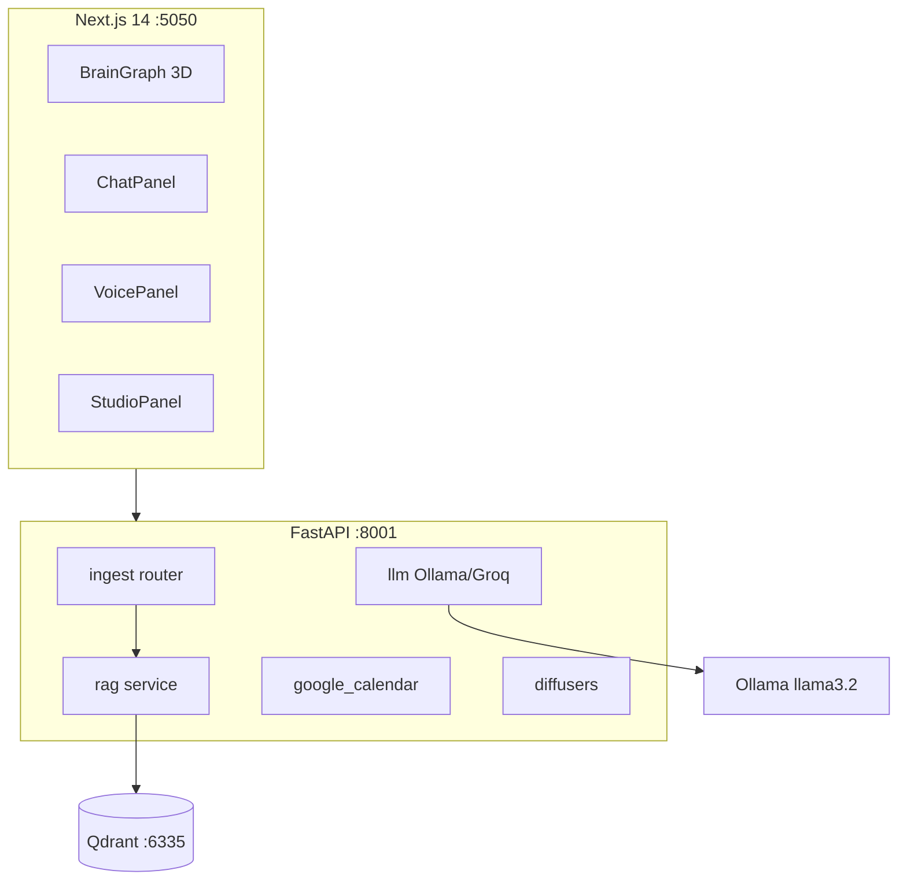

# AI-BRAIN — Changes & Improvements Plan

**Repo:** [Siddarthb07/AI-BRAIN](https://github.com/Siddarthb07/AI-BRAIN)  
**Local clone:** `c:\Users\siddu\OneDrive\Desktop\AI-BRAIN`  
**Current version:** v1.0.0 (JARVIS-branded; not “v3”)  
**Pulled:** 2026-05-24

This document is a **standalone roadmap** for AI-BRAIN. Work here does not affect the Anima repo.

---

## Executive summary

AI-BRAIN is a **real, feature-rich local-first stack** (FastAPI + Next.js + Qdrant + Ollama/Groq): RAG, GitHub ingest, voice, calendar, image studio, 3D graph UI. It is **not production-hardened** — no tests, no CI, README drift, security gaps, and a **broken `.gitignore`** that ignores core source folders.

**Portfolio advice:** Do not lead interviews with “JARVIS personality.” Either **reframe** as a measurable local RAG dev tool, **extract** one subsystem (ingest + eval), or **archive** and port patterns into Lexprobe.

---

## Current baseline

| Area | Status |
|------|--------|
| 3D brain graph + HUD | Shipped |
| GitHub ingest + code deep-read | Shipped |
| RAG (Qdrant + keyword fallback) | Shipped |
| Daily brief + chat | Shipped |
| Voice STT/TTS (browser-first) | Shipped (fragile in Docker) |
| Local file ingest (PDF/DOCX/paste) | Shipped |
| Google Calendar OAuth | Shipped |
| Image / 3D Studio | Shipped (heavy deps) |
| Tests / CI | **Missing** |
| Auth | **Missing** |
| Persistent chat DB | In-memory only |
| LICENSE | **Missing** |

---

## Architecture (today)



**Docker ports (actual):** backend **8001**, frontend **5050**, Qdrant **6335** — README often says 8000/6333.

---

## Phase 0 — Repo hygiene (Week 1, do first)

**Goal:** Repo is safe to commit and clone without losing source.

| # | Task | File / action |
|---|------|----------------|
| 0.1 | **Fix `.gitignore`** — remove lines that ignore `frontend/{app,components}` and `backend/{routers,services}` | `.gitignore` |
| 0.2 | Add `LICENSE` (MIT) | `LICENSE` |
| 0.3 | Add `frontend/package-lock.json` or `pnpm-lock.yaml` and commit | reproducible installs |
| 0.4 | Pin missing deps in `requirements.txt`: `torch`, `openai-whisper` or document faster-whisper-only | `backend/requirements.txt` |
| 0.5 | Remove unused `qdrant-client` or switch RAG to client SDK | `backend/services/rag.py` |

**Done when:** `git status` shows app code trackable; fresh clone + `docker compose up` works from README.

---

## Phase 1 — Documentation truth (Week 1)

**Goal:** README matches the codebase; no port/API lies.

| # | Task |
|---|------|
| 1.1 | Fix all API examples to `localhost:8001` (Docker) and document native vs Docker ports |
| 1.2 | Document Calendar, Media/Studio, Local Ingest endpoints (currently undocumented) |
| 1.3 | Update folder tree: 9 panels, `lib/`, `media.py`, `calendar.py` |
| 1.4 | Add architecture diagram (services + data flow, not only voice) |
| 1.5 | Replace example GitHub user `siddharthmishra` with your handle or generic placeholder |
| 1.6 | Honest limits section: TTS in Docker, GPU/RAM for image gen, Whisper download size |

---

## Phase 2 — Engineering credibility (Week 2)

**Goal:** Interview-defensible “local RAG pipeline,” not cosplay assistant.

| # | Task | Why |
|---|------|-----|
| 2.1 | **Rebrand system prompt** — “local dev context + RAG tool,” drop JARVIS theatrics | `backend/routers/chat.py` |
| 2.2 | **Demo mode flag** — label UI when using hardcoded fallback repos (`github.py`, `store.js`, `BrainGraph.jsx`) | trust |
| 2.3 | **RAG eval script** — ingest 3–5 fixed docs, report recall@k / grounded answer check | `scripts/eval_rag.py` + README table |
| 2.4 | **pytest smoke tests** — `/health`, ingest status, one RAG query with mocked Qdrant | `.github/workflows/ci.yml` |
| 2.5 | **Sync chat history** — single source: backend SQLite or frontend-only with export | `backend/routers/chat.py`, `store.js` |

**Done when:** README has one benchmark/eval table; CI green on smoke tests.

---

## Phase 3 — Security & deploy (Week 3)

**Goal:** Safe enough for localhost demos and optional LAN; not public-internet ready without more work.

| # | Task |
|---|------|
| 3.1 | CORS: `allow_origins=["http://localhost:5050"]` — remove `*` + credentials combo | `backend/main.py` |
| 3.2 | Bind API to `127.0.0.1` by default; document `0.0.0.0` for Docker only |
| 3.3 | Disable or gate `POST /ingest/local/directory` behind `DEV_MODE=1` |
| 3.4 | Encrypt Google OAuth tokens (keyring / encrypted file), not plaintext `state.json` |
| 3.5 | Qdrant: don’t expose host port in prod compose profile; use internal network only |
| 3.6 | Production Docker: `npm run build && start`, uvicorn without `--reload` |

---

## Phase 4 — Feature polish (Week 4+, optional)

| # | Task | Priority |
|---|------|----------|
| 4.1 | Persistent knowledge doc IDs (SHA256, not MD5) | Medium |
| 4.2 | Chat export / import JSON | Low |
| 4.3 | Ollama model selector in UI | Medium |
| 4.4 | Ingest progress WebSocket | Low |
| 4.5 | YouTube transcript ingest (README “future”) | Low |
| 4.6 | Lexprobe cross-link: reuse ingest patterns in Lexprobe repo | **High ROI** |

---

## What to run on your machine (16 GB RAM, Windows)

| Task | Feasible? |
|------|-----------|
| Docker Compose full stack | Yes (close other apps) |
| Ollama `llama3.2` chat | Yes |
| RAG + GitHub ingest | Yes |
| faster-whisper STT | Yes (CPU, slower) |
| Image Studio (diffusers) | Heavy — first run downloads ~GB; CPU slow |
| Groq fallback | Yes (API key) |

```powershell
cd c:\Users\siddu\OneDrive\Desktop\AI-BRAIN
copy .env.example .env
# Edit .env: GROQ_API_KEY, GITHUB_TOKEN optional
docker compose up --build
# UI http://localhost:5050  API http://localhost:8001/docs
```

---

## Milestones

| Tag | Scope | Exit criteria |
|-----|-------|---------------|
| **v1.0.1** | Hygiene | Fixed `.gitignore`, LICENSE, deps pinned |
| **v1.1.0** | Docs + eval | README accurate; RAG eval script + table |
| **v1.2.0** | CI + security | pytest + GitHub Actions; CORS/dev ingest locked down |
| **v2.0.0** | Product reframe | Rebrand, persistent chat, no silent demo data |

---

## Do not do (portfolio)

- Claim “JARVIS v3” or sentient assistant — version is **1.0.0**
- Pin as flagship repo if Lexprobe / NeuralVortex / Anima are stronger
- Deploy to public internet without auth
- Overclaim calendar/RAG accuracy without eval numbers

---

## Suggested weekly order

1. **Week 1:** Phase 0 + Phase 1 (gitignore, README, LICENSE)  
2. **Week 2:** Phase 2 eval + rebrand prompt + demo flag  
3. **Week 3:** Phase 3 security + CI  
4. **Week 4:** Optional polish or extract RAG submodule to new repo  

---

## Key files reference

| Purpose | Path |
|---------|------|
| API entry | `backend/main.py` |
| Chat + persona | `backend/routers/chat.py` |
| RAG | `backend/services/rag.py` |
| GitHub ingest | `backend/routers/ingest.py`, `backend/services/github.py` |
| Frontend shell | `frontend/app/page.js` |
| State | `frontend/app/store.js` |
| 3D graph | `frontend/components/BrainGraph.jsx` |
| Launch | `start.bat`, `docker-compose.yml` |

---

## Relation to other repos

| Pattern in AI-BRAIN | Better home |
|---------------------|-------------|
| Multi-source RAG ingest | **Lexprobe** (production legal RAG) |
| Calendar-aware briefs | Lexprobe or personal automation (private) |
| 3D knowledge viz | Demo only — not core portfolio |
| Voice I/O | Optional Lexprobe feature, not standalone story |

Open this file in a **separate editor window** from Anima when working on AI-BRAIN.

**Full upgrade roadmap:** [UPGRADE_PLAN.md](./UPGRADE_PLAN.md) — vision catalog. **Build JARVIS:** [UPGRADE_PLAN_JARVIS.md](./UPGRADE_PLAN_JARVIS.md). **Council loop:** [JARVIS_COUNCIL_LOOP.md](./JARVIS_COUNCIL_LOOP.md).
