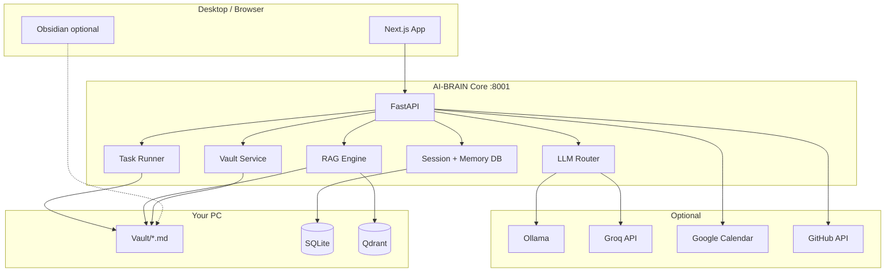
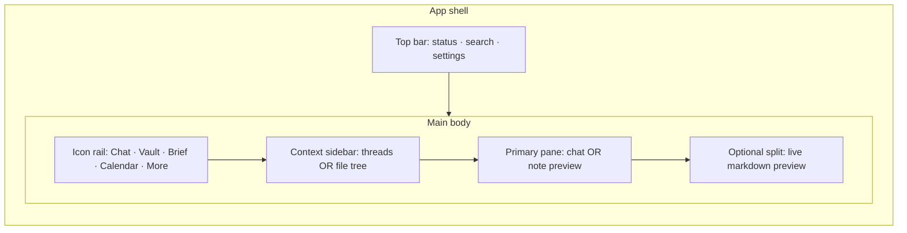

# AI-BRAIN — Full Upgrade Plan (v2 → v3)

**Target product:** A **local-first personal operating system** that combines:
- **Claude** — long-context reasoning, drafting, code, planning, honest answers  
- **Obsidian** — durable markdown vault on disk, wikilinks, search, graph of *your* notes  
- **JARVIS (real)** — proactive briefs, calendar-aware priorities, voice when useful, **tasks that leave artifacts on your PC**

**Not the target:** Cosplay chatbot, fake demo repos, browser-only downloads, 3D graph with no real knowledge behind it.

**Repo:** `Siddarthb07/AI-BRAIN` · **Current:** v1.0.0 · **Plan version:** 2026-05-24 · **Execute:** [UPGRADE_PLAN_JARVIS.md](./UPGRADE_PLAN_JARVIS.md) (council final 8.3/10)

Open this file in a **separate window** from other projects (Anima, Lexprobe, etc.).

> **Build from:** [UPGRADE_PLAN_JARVIS.md](./UPGRADE_PLAN_JARVIS.md) — keeps JARVIS, 8-item v2.0 box  
> **Council loop:** [JARVIS_COUNCIL_LOOP.md](./JARVIS_COUNCIL_LOOP.md) (3 rounds)  
> **Deprecated:** [UPGRADE_PLAN_v2.md](./UPGRADE_PLAN_v2.md) (VaultMind rebrand)

---

## 1. North star & success criteria

### You should be able to…

| Capability | Claude+Obsidian today | AI-BRAIN v1 | AI-BRAIN v3 target |
|------------|----------------------|-------------|-------------------|
| Ask questions over **your** notes | Yes (plugins / copy-paste) | Partial (RAG, mixed with fake data) | Yes — vault-native RAG |
| **Save** a reply as a `.md` file in your vault | Manual copy | Browser download only | One-click + auto-save |
| Resume conversations tomorrow | Manual export | Lost on restart | Persistent threads |
| Draft long docs / specs / code | Excellent | Truncated (512 tokens) | 4k–8k+ tokens, structured output |
| Link notes (`[[wikilinks]]`) | Native | No | Generated + parsed |
| Full-text search vault | Instant | Qdrant optional | FTS + semantic hybrid |
| Trust what’s indexed | Your files only | Demo repos injected | **Zero silent fallbacks** |
| Daily planning | Manual + calendar | Brief (generic JSON) | Brief → saved note + tasks |
| Offline / local LLM | N/A (cloud) | Ollama (good) | Ollama primary, cloud optional |
| Voice | N/A | Browser STT/TTS | Push-to-talk + optional wake |
| **UI feels usable daily** | Polished | Sci-fi demo, 3D-first | Work-mode desk app (Claude/Obsidian-like) |
| Find saved notes in app | N/A | No vault browser | Vault sidebar + search |

### v3 “done” definition

1. **Every assistant output can land on disk** in a configured vault path (Obsidian-compatible).  
2. **RAG indexes vault + chosen folders only** — no fake GitHub repos unless `DEMO_MODE=1`.  
3. **Chat history survives restarts** with export to markdown.  
4. **Measurable RAG quality** — eval script with published recall@k on a fixed corpus.  
5. **One-command setup** on Windows 16 GB RAM: Docker + Ollama + vault path.  
6. **CI green** on smoke + vault + RAG tests.

---

## 2. Honest gap analysis (why v1 feels “bullshit”)

| Problem | Root cause | User impact |
|---------|------------|-------------|
| Can’t save docs to PC | Only client-side blob download; no vault API wired in UI | Nothing durable; not Obsidian |
| Answers feel generic | 512-token cap, weak system prompt, demo fallbacks | Not comparable to Claude |
| “Knowledge” lies | `FALLBACK_REPOS`, frontend `FALLBACK_REPOS`, brief fallbacks | Graph looks full when empty |
| RAG misses your notes | Ingest is GitHub/HN/upload — not Obsidian vault sync | Wrong corpus |
| Chat resets | In-memory `_history` | No continuity |
| README ≠ product | Ports, APIs, panels undocumented | Hard to trust or demo |
| `.gitignore` breaks repo | Ignores `backend/routers`, `frontend/app` | Maintenance risk |
| Docker = dev mode | `--reload`, `npm run dev` | Slow, fragile TTS |
| No eval | No quality bar | Can’t prove improvement |
| UI is hard to use daily | 3D graph steals 50% width; inline styles; no vault UI | Feels like a demo, not a desk app |
| No empty states | Fake data fills graph | User can’t tell what’s real |

**Partial work already drafted locally (not shipped):** `backend/services/vault.py`, `backend/routers/vault.py`, `backend/services/chat_history.py` — use as Phase 2 starting point.

---

## 3. Target architecture (v3)



**Design principles**

1. **Vault is source of truth** — Qdrant is a cache/index of vault + explicit ingests.  
2. **Artifacts over vibes** — every workflow ends in a file, task list, or calendar block.  
3. **Fail loud** — offline/errors shown in UI; no fake data.  
4. **Local-first** — cloud LLM is optional boost, not requirement.

---

## 4. Upgrade plan by domain

### 4.1 Knowledge vault (Obsidian parity) — **P0**

| # | Feature | Description | Files / notes |
|---|---------|-------------|---------------|
| V1 | Vault path config | `VAULT_PATH` / `OBSIDIAN_VAULT_PATH` in `.env` | `.env.example`, settings UI |
| V2 | Folder layout | `JARVIS/Chat`, `Briefs`, `Generated`, `Inbox`, `Projects` | `services/vault.py` |
| V3 | Save note API | `POST /vault/save` with YAML frontmatter (title, tags, created, source) | `routers/vault.py` |
| V4 | Save from chat | Button on **every** assistant message + optional auto-save | `ChatPanel.jsx`, chat router |
| V5 | Save brief daily | `Briefs/YYYY-MM-DD-daily.md` | `routers/brief.py` |
| V6 | Code block extraction | Fenced blocks → `Generated/` as real files | `vault.extract_code_artifacts` |
| V7 | Open in Explorer | `POST /vault/open` | Windows/macOS/Linux |
| V8 | Wikilinks | `[[note-title]]` in generated md; backlink index | new `services/links.py` |
| V9 | Obsidian coexistence | Never write inside `.obsidian/`; respect user vault root | vault walker skips |
| V10 | Templates | Note templates (meeting, project, spec) | `vault/templates/*.md` |

**Acceptance:** User asks “write a project spec for X” → clicks Save → file appears in Obsidian vault within 2 seconds.

---

### 4.2 RAG & memory — **P0**

| # | Feature | Description |
|---|---------|-------------|
| R1 | Vault sync job | Walk `**/*.md`, chunk, embed, upsert Qdrant; incremental by mtime |
| R2 | Hybrid search | BM25 (SQLite FTS or tantivy) + vector merge |
| R3 | Source citations | Chat returns `[1]` footnotes with `relative_path` + line range |
| R4 | Chunk metadata | path, heading, mtime, tags from frontmatter |
| R5 | MD5 → SHA256 IDs | Fix collision risk in `rag.py` |
| R6 | Relevance threshold | Don’t inject junk context; show “no vault hits” honestly |
| R7 | Multi-collection | `vault`, `github`, `uploads` collections |
| R8 | Eval harness | `scripts/eval_rag.py` — 20 queries, recall@5, cite rate |
| R9 | Watch mode (optional) | `watchdog` re-index on vault file change |

**Acceptance:** With 50 notes in vault, ask “what did I write about Lexprobe?” → answer cites real file paths.

---

### 4.3 LLM & reasoning — **P0**

| # | Feature | Description |
|---|---------|-------------|
| L1 | Remove persona theater | System prompt = personal knowledge assistant, not “elite JARVIS embedded in brain” |
| L2 | Raise token limits | Ollama `num_predict` 4096+; Groq `max_tokens` 4096 |
| L3 | Model router | Small model for classify/summarize; large for draft/code |
| L4 | Structured outputs | JSON mode for brief/tasks; markdown mode for docs |
| L5 | Tool use loop | `save_note`, `search_vault`, `list_calendar`, `run_ingest` as function calls |
| L6 | Context assembly | Vault snippets + calendar + goals + last N chat turns (token budget) |
| L7 | Streaming SSE | `POST /chat/stream` for long drafts |
| L8 | Model picker UI | Choose Ollama model per session |
| L9 | Honest offline | Clear error when Ollama down — no canned “stay focused” filler |

**Recommended models (16 GB RAM CPU):**

| Role | Model |
|------|--------|
| Default chat | `llama3.2` / `qwen2.5:3b` |
| Long draft | Groq `llama-3.3-70b` (API) or `mistral-nemo` local |
| Embeddings | `all-MiniLM-L6-v2` (keep) or `nomic-embed-text` via Ollama |

---

### 4.4 Chat & sessions — **P0**

| # | Feature | Description |
|---|---------|-------------|
| C1 | SQLite sessions | `sessions`, `messages` tables; replace in-memory list |
| C2 | Thread list UI | New / rename / delete conversations |
| C3 | Export thread | Whole thread → single markdown in vault |
| C4 | Edit & regenerate | User edits last message, retry |
| C5 | Pin messages | Star important answers → Inbox |
| C6 | Attach note context | `@note` or picker to inject full note into prompt |
| C7 | Compare to Claude UX | Split pane: chat + live preview of note being written |

---

### 4.5 Tasks & agent workflows — **P1**

| # | Feature | Description |
|---|---------|-------------|
| T1 | Task objects | `{ id, title, status, due, source_note }` in SQLite |
| T2 | Extract tasks from chat | Checkbox lines `- [ ]` → tasks table + optional sync to note |
| T3 | “Do this for me” flows | e.g. “Summarize all PDFs in Downloads” → staged plan → execute with confirm |
| T4 | Brief → tasks | Priority actions become checkboxes in daily note |
| T5 | Project mode | Long-running goal + linked notes in `Projects/` |
| T6 | Safe execution sandbox | No arbitrary shell; whitelist: ingest, vault save, calendar read |

**Not v3:** Full autonomous OS control (email send, shell rm -rf).

---

### 4.6 Ingest pipeline — **P1**

| # | Feature | Description |
|---|---------|-------------|
| I1 | Remove `FALLBACK_REPOS` | Return `[]` + UI banner “Connect GitHub” |
| I2 | Vault as primary ingest | On startup: sync vault if `AUTO_SYNC_VAULT=1` |
| I3 | Watch folder ingest | `WATCH_FOLDERS=C:\Users\...\Downloads` |
| I4 | PDF/DOCX to vault | Ingest converts to md in `Inbox/` then indexes |
| I5 | GitHub deep-read limits | Configurable depth; progress WebSocket |
| I6 | YouTube transcripts | Optional: whisper + save to `Inbox/` |
| I7 | Dedup by content hash | Skip re-embedding unchanged files |

---

### 4.7 Daily brief & calendar — **P1**

| # | Feature | Description |
|---|---------|-------------|
| B1 | Brief saves to vault | Auto `Briefs/YYYY-MM-DD.md` |
| B2 | Less JSON theater | Readable markdown brief, not only HUD cards |
| B3 | Calendar-driven priorities | Next event prep blocks in brief |
| B4 | Weekly review | Sunday rollup note from last 7 briefs |
| B5 | Remove generic fallback brief | Show “LLM unavailable” state |

---

### 4.8 Voice — **P2**

| # | Feature | Description |
|---|---------|-------------|
| Vo1 | Push-to-talk default | Hold key to speak; no always-listening in v3 |
| Vo2 | faster-whisper primary | Fix deps; document model download size |
| Vo3 | Read saved note aloud | TTS from vault file, not truncated chat |
| Vo4 | Voice commands | “Save that”, “Search vault for X”, “Open today’s brief” |
| Vo5 | Drop broken Docker TTS | Document browser TTS as default in containers |

---

### 4.9 UI / UX — **P1** (summary)

High-level UI goals. **Full spec:** [§13 Full UI upgrade plan](#13-full-ui-upgrade-plan).

| # | Feature | Description |
|---|---------|-------------|
| U1 | **VAULT tab** | Path, sync status, note list, open folder |
| U2 | Settings panel | Vault path, models, auto-save, demo mode off |
| U3 | Citation chips | Click → open note in Obsidian or in-app viewer |
| U4 | Markdown preview | Proper renderer (already have react-markdown) |
| U5 | Layout modes | **Work mode** (chat + vault default); **Graph mode** optional |
| U6 | Demo mode badge | Visible when fallbacks would have fired |
| U7 | Keyboard shortcuts | `Ctrl+Enter` send, `Ctrl+S` save to vault |
| U8 | Design system | Replace inline sci-fi styles with reusable tokens + components |

---

### 4.10 Studio / media — **P3 (optional)**

| # | Feature | Description |
|---|---------|-------------|
| S1 | Save images to vault `Assets/` | Not only `backend/data/generated` |
| S2 | Lazy-load diffusers | Optional extra; off by default on 16 GB |
| S3 | 3D preview | Keep for demos; not core v3 |

---

### 4.11 Security & privacy — **P1**

| # | Feature | Description |
|---|---------|-------------|
| Sec1 | Fix CORS | `localhost:5050` only; no `*` + credentials |
| Sec2 | Bind API `127.0.0.1` by default | Document LAN bind |
| Sec3 | Encrypt OAuth tokens | OS keyring or encrypted blob |
| Sec4 | Gate directory ingest | `DEV_MODE=1` only |
| Sec5 | Vault path jail | All writes under resolved vault root |
| Sec6 | No secrets in logs | Redact tokens |
| Sec7 | Optional API key | For LAN access with single-user password |

---

### 4.12 DevOps, quality, docs — **P1**

| # | Feature | Description |
|---|---------|-------------|
| D1 | Fix `.gitignore` | Remove rules ignoring source trees |
| D2 | `LICENSE` MIT | |
| D3 | Pin deps | torch, whisper, lockfiles |
| D4 | GitHub Actions | lint + pytest smoke + vault save test |
| D5 | README v2 | Ports, vault setup, Claude+Obsidian comparison |
| D6 | `docs/ARCHITECTURE.md` | |
| D7 | `docs/API.md` | OpenAPI export |
| D8 | Docker prod profile | `docker compose -f compose.prod.yml` |
| D9 | Version bump | v2.0.0 vault release, v3.0.0 agent loop |

---

### 4.13 Performance (16 GB Windows) — **P1**

| Workload | Strategy |
|----------|----------|
| Ollama 3B–8B | Primary; close Chrome during load |
| Qdrant | Docker; limit collection size |
| Embeddings | Batch vault sync overnight |
| Image studio | Disabled by default (`IMAGE_ENABLED=false`) |
| Whisper | `base` model; CPU |
| Page file | 16–32 GB virtual memory |

---

## 5. Phased delivery roadmap

### Phase 0 — Stop the bleeding (Week 1)

- Fix `.gitignore`, LICENSE, remove/gate all fallback demo data  
- Fix README ports (8001 / 5050 / 6335)  
- CORS + vault path jail  
- Ship stub `vault` router wired to UI (save button)  
- **UI:** Status bar shows backend/Ollama/vault path; demo banner when empty; remove misleading “NEURONS” counts when no data

**Tag:** `v1.0.1`

---

### Phase 1 — Obsidian core (Weeks 2–3) — **MVP of “real product”**

- Full vault service + save from chat/brief/code extract  
- Vault sync → RAG  
- Persistent chat (SQLite)  
- New system prompt + 4k tokens  
- VAULT tab + settings  
- Remove fake repos from graph  
- **UI:** Work-mode layout (chat primary); VaultPanel; Save on every message; thread sidebar; empty states

**Tag:** `v2.0.0`  
**Metric:** 10 manual test flows documented; user saves 5 notes from chat to real vault.

---

### Phase 2 — Claude-class answers (Weeks 4–6)

- Hybrid search + citations  
- Streaming chat  
- Thread management + export  
- RAG eval script + README table  
- CI smoke tests  
- Brief → tasks in vault  
- **UI:** Split-pane chat + preview; citation chips; streaming tokens; command palette (`Ctrl+K`); design tokens v1

**Tag:** `v2.1.0`  
**Metric:** recall@5 ≥ 0.7 on fixed 20-query eval set.

---

### Phase 3 — JARVIS workflows (Weeks 7–10)

- Tool-calling loop (save, search, calendar, ingest)  
- Proactive brief + weekly review notes  
- Voice commands for save/search  
- Optional watch-folder ingest  
- Model router + picker  
- **UI:** Task inbox panel; brief as readable markdown; voice push-to-talk overlay; resizable panels

**Tag:** `v3.0.0`  
**Metric:** 3 end-to-end demos recorded: plan day, draft spec, research repo → all land in vault.

---

### Phase 4 — Polish & portfolio (Weeks 11–12)

- Production Docker profile  
- Architecture docs  
- Optional: extract `jarvis-vault` as reusable library for Lexprobe  
- **UI:** Light theme; onboarding wizard; Graph mode as optional tab; accessibility pass; UI screenshot set for README

**Tag:** `v3.1.0`

---

## 6. Feature priority matrix

| Priority | Domains |
|----------|---------|
| **P0** | Vault save, vault RAG, kill fallbacks, chat persistence, LLM limits, citations, **work-mode UI + vault panel** |
| **P1** | Tasks, brief→vault, ingest cleanup, security, **design system + chat UX**, CI/eval |
| **P2** | Voice commands, streaming UI, hybrid FTS, weekly review, **command palette** |
| **P3** | Studio to vault, 3D graph as optional tab, YouTube ingest, light theme |

---

## 7. Comparison: workflows

### Today (v1)

```
User → Chat → generic answer → optional browser download → lost on refresh
Vault (Obsidian) ──X── not connected
```

### Target (v3)

```
User → Chat (+ vault RAG + calendar context)
     → streamed answer with citations
     → Save to VAULT/JARVIS/Chat/2026-05-24-topic.md
     → Obsidian opens / indexes same file
     → nightly sync refreshes Qdrant
     → tomorrow: "continue yesterday's spec" loads thread + note
```

---

## 8. What NOT to build (scope control)

- Claiming consciousness or “JARVIS personality” in prompts  
- Public multi-user SaaS without auth  
- Replacing Obsidian editor (link to Obsidian instead)  
- Autonomous shell/email without confirmation  
- Crypto / blockchain / NFT graph nodes  
- More 3D animations before vault works  

---

## 9. Hardware & env template

```env
# Vault (required for v2+)
VAULT_PATH=C:\Users\You\Documents\My-Obsidian-Vault
AUTO_SAVE_VAULT=1
AUTO_SYNC_VAULT=1

# LLM
OLLAMA_URL=http://localhost:11434
OLLAMA_MODEL=llama3.2
GROQ_API_KEY=           # optional quality boost
LLM_MAX_TOKENS=4096

# RAG
QDRANT_URL=http://localhost:6335
EMBEDDING_MODEL=all-MiniLM-L6-v2

# Safety
DEMO_MODE=0
DEV_MODE=0
IMAGE_ENABLED=false
```

---

## 10. Success metrics dashboard (publish in README)

| Metric | v1 | v2 target | v3 target |
|--------|-----|-----------|-----------|
| Notes saved to disk / session | 0 | 5+ | 10+ |
| RAG recall@5 (eval set) | untested | 0.5 | 0.7 |
| Chat persistence | none | SQLite | threads + export |
| Silent fallback usage | high | zero | zero |
| Time to first saved note (new user) | N/A | < 10 min | < 5 min |
| pytest smoke tests | 0 | 10 | 25 |
| UI: clicks to save chat → vault | N/A | ≤ 2 | 1 (auto-save option) |
| UI: Lighthouse accessibility | untested | ≥ 85 | ≥ 92 |

---

## 11. Relation to your other projects

| AI-BRAIN pattern | Port to |
|------------------|---------|
| Vault + RAG ingest | **Lexprobe** (legal corpus) |
| Citation-first chat | **Lexprobe** / **Anima** docs |
| Task + brief flows | Personal (private), not portfolio |
| 3D graph | Demo only |

**Portfolio recommendation:** After v2, rename publicly to something like **“VaultMind”** or **“Local RAG Desk”** — engineering name, not JARVIS cosplay.

---

## 12. Immediate next steps (when you start building)

1. Read Phase 0 checklist — fix `.gitignore` and fallbacks first.  
2. Finish wiring `services/vault.py` + `routers/vault.py` (already drafted).  
3. Add **Save to Vault** on every `ChatPanel` bubble.  
4. Set `VAULT_PATH` to your real Obsidian vault in `.env`.  
5. Run vault sync → ask a question about your notes.  
6. Do **not** add new 3D features until step 5 works.

---

## 13. Full UI upgrade plan

This section is the **detailed frontend roadmap**. Current stack: Next.js 14, Zustand (`store.js`), heavy inline styles, sci-fi HUD (`Orbitron` + scanlines), split layout with **3D brain ~60% width** and tabbed side panel (`page.js`).

**Design north star:** Feel like **Claude desktop + Obsidian sidebar** on first open — not a game HUD with chat bolted on.

### 13.1 Current UI audit (v1)

| Issue | Where | Fix direction |
|-------|-------|---------------|
| 3D graph is default hero | `page.js` layout | **Work mode** default; graph optional |
| All-caps tab labels + ascii icons | `TABS` in `page.js` | Sentence case + lucide icons |
| Inline styles everywhere | All panels | CSS modules or Tailwind + shared components |
| Sci-fi scanlines + glow | `globals.css` | Subtle dark theme; optional “Arcade mode” toggle |
| No vault surface | Missing panel | `VaultPanel.jsx` + nav item |
| Chat download ≠ save | `ChatPanel.jsx` | “Save to vault” primary action |
| Misleading stats | `BrainHUD` “NEURONS” | Real counts or hide when zero |
| No thread list | Chat only | Left sidebar like Claude |
| No settings UI | Env-only config | `SettingsPanel` modal |
| No responsive layout | Fixed split | Collapse graph on `< 1200px` |
| No loading/skeleton states | Spinners only | Skeleton for brief, chat, vault list |
| Accessibility gaps | Low contrast dim text | WCAG AA on body text |

### 13.2 Design direction

**References (pick best parts, don’t clone):**

| Product | Borrow |
|---------|--------|
| **Claude** | Thread sidebar, clean message bubbles, streaming cursor, copy/save actions |
| **Obsidian** | File tree, wikilink styling, muted purple-gray dark theme |
| **Linear** | Density, keyboard-first, command palette |
| **Notion** | Split editor/preview for long drafts |

**Tone:** Professional personal tool — “your second brain desk,” not Iron Man cosplay.

**Two visual modes (user toggle):**

| Mode | Default | Description |
|------|---------|-------------|
| **Work** | Yes | Minimal chrome, chat + vault, no scanlines |
| **Graph** | No | Current 3D brain + legend (demo / explore) |

### 13.3 Target layout (Work mode)



**Default on open:** Chat selected, thread list visible, vault path in status bar, graph **hidden**.

**Breakpoints:**

| Width | Layout |
|-------|--------|
| ≥ 1400px | Nav + sidebar + main + optional preview (4 columns) |
| 1024–1399px | Nav + sidebar + main (preview as tab) |
| < 1024px | Single column; sidebar as drawer; graph disabled |

### 13.4 Design system — **P0**

| # | Item | Spec |
|---|------|------|
| DS1 | Token file | `frontend/styles/tokens.css` — colors, spacing, radius, shadows |
| DS2 | Typography | **Inter** or **Geist** body; **JetBrains Mono** code; drop Orbitron from default |
| DS3 | Color palette | Obsidian-like: `#1e1e1e` bg, `#2d2d2d` panels, accent `#7c6af7` or soft blue |
| DS4 | Component library | `frontend/components/ui/` — Button, Input, Badge, Tabs, Dialog, Toast |
| DS5 | Icons | `lucide-react` — consistent 18px stroke |
| DS6 | Spacing scale | 4px base: 4, 8, 12, 16, 24, 32 |
| DS7 | Motion | 150–200ms ease; respect `prefers-reduced-motion` |
| DS8 | Tech choice | **Tailwind CSS v4** or CSS modules (avoid half-inline half-tailwind) |

**Files to refactor first:** `globals.css`, `page.js`, `ChatPanel.jsx`, `HUD.jsx` → `AppShell.jsx`.

### 13.5 App shell & navigation — **P0**

| # | Feature | Description |
|---|---------|-------------|
| UI-N1 | `AppShell` | Replace monolithic `page.js` layout |
| UI-N2 | Icon rail | Chat · Vault · Brief · Calendar · Ingest · Graph · Settings |
| UI-N3 | Context sidebar | Swaps content per mode (threads / vault tree / calendar list) |
| UI-N4 | Top status bar | Ollama ● / Qdrant ● / Vault path (truncated) / sync spinner |
| UI-N5 | Command palette | `Ctrl+K` — search vault, switch thread, open settings |
| UI-N6 | Breadcrumbs | `Vault / JARVIS / Chat / 2026-05-24-topic.md` when viewing note |
| UI-N7 | More menu | Voice, Studio, legacy panels — deprioritized |
| UI-N8 | Onboarding empty state | First run: “Set vault path” wizard before chat |

### 13.6 Chat panel upgrade (Claude-class) — **P0**

| # | Feature | Description |
|---|---------|-------------|
| UI-C1 | Thread sidebar | List sessions; new chat; rename; delete |
| UI-C2 | Message layout | User right / assistant left; max-width ~720px readable column |
| UI-C3 | Streaming | Token-by-token render + stop button |
| UI-C4 | Message actions | Copy · **Save to vault** · Regenerate · Pin · Speak |
| UI-C5 | Code blocks | Syntax highlight (`shiki` or `prism`); copy; **Save as file** |
| UI-C6 | Citations | Footnote chips under message → open vault note |
| UI-C7 | Composer | Multi-line textarea; `Shift+Enter` newline; `Ctrl+Enter` send |
| UI-C8 | Context pills | Attached notes / calendar / repo shown above composer |
| UI-C9 | `@` mentions | `@note`, `@today-brief` autocomplete |
| UI-C10 | Split preview | Toggle right pane: live render of doc being drafted |
| UI-C11 | Model indicator | Small badge: `llama3.2` / `groq-70b` |
| UI-C12 | Error states | Red inline banner when Ollama offline — no fake reply |

### 13.7 Vault panel (Obsidian-class) — **P0**

| # | Feature | Description |
|---|---------|-------------|
| UI-V1 | `VaultPanel.jsx` | New primary surface |
| UI-V2 | File tree | Folders under `JARVIS/`; expand/collapse |
| UI-V3 | Note viewer | Read-only markdown + “Open in Obsidian” / Explorer |
| UI-V4 | Search box | Instant filter + semantic search toggle |
| UI-V5 | Sync controls | Last synced time; **Sync now** button; progress bar |
| UI-V6 | Save feedback | Toast: “Saved to `JARVIS/Chat/…`” with open link |
| UI-V7 | New note | Template picker → creates file in vault |
| UI-V8 | Backlinks panel | Notes linking to current note (when API ready) |
| UI-V9 | Drag reorder | Optional: pin favorites in sidebar |

### 13.8 Other panels — **P1–P2**

| Panel | Upgrades |
|-------|----------|
| **Brief** | Markdown-first layout; “Save to vault” prominent; task checkboxes inline |
| **Calendar** | Week strip; connect CTA when disconnected; event → prep note button |
| **Ingest** | Step wizard: GitHub / Upload / Watch folder; real progress, no fake repos |
| **Voice** | Floating push-to-talk button; waveform; transcript lands in composer |
| **Studio** | Collapse behind “More”; warn on heavy GPU/RAM |
| **Graph** | Full-screen optional tab; honest empty state: “Index your vault first” |
| **Nodes** | Merge into vault search or graph detail drawer |

### 13.9 Feedback, states & accessibility — **P1**

| # | Feature | Description |
|---|---------|-------------|
| UI-F1 | Toasts | Success / error / info — bottom-right stack |
| UI-F2 | Skeletons | Chat messages, vault list, brief cards while loading |
| UI-F3 | Empty states | Illustration + one CTA per panel (“Connect GitHub”, “Set vault path”) |
| UI-F4 | Demo banner | Yellow bar when `DEMO_MODE=1` or zero indexed docs |
| UI-F5 | Focus rings | Visible keyboard focus on all interactive elements |
| UI-F6 | ARIA | Live regions for streaming chat; labels on icon-only buttons |
| UI-F7 | Contrast | Body text ≥ 4.5:1; dim text ≥ 3:1 |
| UI-F8 | Shortcuts sheet | `?` key opens keyboard shortcut overlay |

**Keyboard map (v2):**

| Shortcut | Action |
|----------|--------|
| `Ctrl+K` | Command palette |
| `Ctrl+Enter` | Send message |
| `Ctrl+S` | Save current message / note to vault |
| `Ctrl+N` | New chat |
| `Ctrl+B` | Toggle sidebar |
| `Ctrl+\` | Toggle split preview |
| `Esc` | Close modal / stop generation |

### 13.10 3D graph repositioning — **P2**

| # | Decision | Rationale |
|---|----------|-----------|
| G1 | Not default view | Users open for work, not spectacle |
| G2 | Lazy load always | Keep `BrainGraph` code-split |
| G3 | Link to selection | Click node → open vault note or GitHub repo in sidebar |
| G4 | Performance cap | Pause render when tab hidden; reduce particles on 16 GB |
| G5 | “Arcade mode” | Optional scanlines + Orbitron for demos only |

### 13.11 Frontend architecture changes

```
frontend/
  app/
    layout.js          # fonts, providers
    page.js            # thin: renders AppShell
  components/
    shell/             # AppShell, TopBar, IconRail, Sidebar
    ui/                # design system primitives
    chat/              # ChatPanel split into ThreadList, MessageList, Composer
    vault/             # VaultPanel, FileTree, NoteViewer
    ...existing panels refactored
  lib/
    api.js             # centralized fetch + error handling
    shortcuts.js
  styles/
    tokens.css
    work-theme.css
    arcade-theme.css   # optional
```

| # | Task | Description |
|---|------|-------------|
| FE1 | `lib/api.js` | Single API client; typed errors; base URL from env |
| FE2 | Split `store.js` | `useChatStore`, `useVaultStore`, `useAppStore` slices |
| FE3 | React Query (optional) | Cache vault list, brief, health — fewer manual polls |
| FE4 | Storybook (optional) | Document UI components for portfolio |

### 13.12 UI delivery by phase

| Phase | UI deliverables |
|-------|-----------------|
| **0** | Honest status bar; demo/empty banner; fix misleading HUD counts |
| **1** | Work-mode layout; VaultPanel v1; Save to vault on chat; settings modal; design tokens |
| **2** | Thread sidebar; streaming UI; citations; command palette; split preview |
| **3** | Task inbox UI; brief markdown view; voice overlay; resizable panels |
| **4** | Light theme; onboarding wizard; Graph tab; a11y audit; README screenshots |

### 13.13 UI acceptance criteria (v3)

1. New user lands on **Chat + thread list** — no 3D graph visible by default.  
2. **Save to vault** visible on every assistant message; toast confirms path.  
3. Vault file tree shows notes saved in last session after refresh.  
4. App usable at **1280×720** without horizontal scroll.  
5. Lighthouse accessibility **≥ 92** on Work mode home.  
6. Zero panels show fake data when backend returns empty.

### 13.14 UI “do not do”

- Re-skin without fixing layout (cosmetic-only pass)  
- Add animations before vault save works  
- Build a full markdown **editor** (link out to Obsidian)  
- More HUD chrome (corner brackets, scanlines) in Work mode  
- Mobile-first PWA before desktop work mode is solid  

---

## Related docs

- [UPGRADE_PLAN_v2.md](./UPGRADE_PLAN_v2.md) — **Council-revised execution plan** (use this to build)
- [LLM_COUNCIL_REVIEW.md](./LLM_COUNCIL_REVIEW.md) — 5-member ratings, debates, dissent
- [IMPROVEMENTS_PLAN.md](./IMPROVEMENTS_PLAN.md) — shorter audit + hygiene checklist  
- [../README.md](../README.md) — current user-facing docs (needs Phase 1 rewrite)

---

*This plan is the single source of truth for the full upgrade. Implement phase-by-phase; do not skip Phase 0.*
