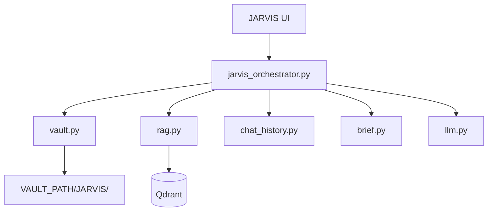

# JARVIS — Upgrade Plan v1.1 (Council 9.0+)

**Version:** 2026-05-24 · **Council score:** **9.2/10** (6 rounds)  
**Loop transcript:** [JARVIS_COUNCIL_LOOP.md](./JARVIS_COUNCIL_LOOP.md)  
**Supersedes:** prior `UPGRADE_PLAN_JARVIS.md` sections where noted  
**Reference backlog:** [UPGRADE_PLAN.md](./UPGRADE_PLAN.md)

---

## Executive summary

**JARVIS** = local **chief-of-staff AI**. Reads/writes Obsidian vault, morning brief to disk, situational HUD + mini-map (real data only), confirmed actions — **never fakes data**.

| | |
|---|---|
| **v2.0 ship** | Week 8 (~60–80 hrs solo) |
| **v3.0 ship** | Week 16 |
| **Platform** | Windows 16 GB · Ollama + Docker (Qdrant) |
| **One-liner** | *Local JARVIS — reads your vault, runs your day, saves everything.* |

**Read next if building:** [§10 Phase gates](#10-phase-gates-exact) · [§11 E2E tests](#11-e2e-acceptance-tests) · [§12 API contracts](#12-api-contracts-v20)

---

## 1. What JARVIS is (locked)

> JARVIS is a proactive local chief-of-staff: it assembles context from your **vault**, **calendar**, and **indexed knowledge**, helps you **plan and write**, and **saves artifacts to disk** after you confirm actions — not a roleplay chatbot.

| JARVIS **is** | JARVIS **is not** |
|---------------|-------------------|
| Daily brief → `JARVIS/Briefs/*.md` | Conscious / “embedded in brain” |
| HUD: Ollama, Qdrant, vault, sync, next event | Fake neurons or demo repos |
| Chat + RAG with **file citations** | Browser-only download |
| Mini-map of **indexed** nodes | 3D hero on empty data |
| Confirm-before-run actions + audit log | Autonomous shell / email |

**System prompt (Phase 0, copy verbatim):**

```
You are JARVIS, a local chief-of-staff assistant. Help the user plan, write, and organize using their Obsidian vault and indexed knowledge. Be direct, proactive, and factual. Propose next actions as bullet points. Never claim consciousness or fabricate data.
```

---

## 2. v2.0 scope box (8 items — frozen)

| # | Capability | Proof |
|---|------------|-------|
| 1 | Vault write | E2E-03, E2E-04 |
| 2 | Vault RAG + citations | E2E-05, E2E-06 |
| 3 | Persistent chat | E2E-07 |
| 4 | JARVIS HUD | E2E-01 |
| 5 | Daily brief → vault | E2E-08 |
| 6 | Command center UI | E2E-02 |
| 7 | Action proposals + audit | E2E-09 |
| 8 | Zero fake data | E2E-10 + pytest |

**Explicit OUT for v2.0:** autonomous agent · hybrid FTS · streaming · voice · studio default · wikilinks · command palette · light theme

---

## 3. UI — command center

```
┌──────────────────────────────────────────────────────────────┐
│ JARVIS  ·  Ollama ●  Qdrant ●  Vault ✓  ·  Sync 2m ago     │
├──────────┬─────────────────────────────────┬─────────────────┤
│ Threads  │           CHAT (≥50% width)   │ Today’s Brief   │
│ + New    │                                 │ Vault list      │
│          │  [Action: Sync vault] [Confirm] │ Quick actions   │
├──────────┴─────────────────────────────────┴─────────────────┤
│ Knowledge mini-map (240px) · hidden if nodes=0 · Expand (G)  │
└──────────────────────────────────────────────────────────────┘
```

| State | UI behavior |
|-------|-------------|
| Ollama down | Red HUD dot + banner; no fake reply |
| Qdrant down | Yellow dot; chat works without RAG badge “offline” |
| Vault unset | Blocking setup modal; chat disabled |
| Zero indexed nodes | Mini-map hidden; empty state CTA “Sync vault” |
| `DEMO_MODE=1` | Yellow banner “Demo mode” |

**Keyboard:** `Ctrl+Enter` send · `Ctrl+S` save message · `G` expand graph · `Esc` dismiss modal

---

## 4. Architecture



### JOL v0 — action JSON schema

```json
{
  "reply": "string",
  "citations": [{"path": "JARVIS/Notes/x.md", "snippet": "..."}],
  "actions": [
    {
      "id": "uuid",
      "type": "save_note|sync_vault|search_vault|write_brief|open_in_explorer",
      "label": "Save to vault",
      "params": {},
      "requires_confirm": true
    }
  ]
}
```

Audit: append-only `JARVIS/Logs/actions.jsonl` — `{ts, action_type, params_hash, result, session_id}`

---

## 5. File touch map (implementation index)

| Phase | Backend | Frontend |
|-------|---------|----------|
| 0 | `main.py`, `chat.py`, `github.py`, `store.py`, `.gitignore`, `tests/` | `page.js`, `HUD.jsx`, `store.js`, `globals.css` |
| 1a | `services/vault.py`, `routers/vault.py`, `main.py` | — |
| 1b | `services/rag.py`, `routers/chat.py`, `scripts/eval_rag.py` | `ChatPanel.jsx` citations |
| 1c | `services/chat_history.py`, `services/jarvis_orchestrator.py` | `store.js` sessions |
| 2 | `routers/brief.py`, `routers/context.py` | `AppShell.jsx`, `VaultPanel.jsx`, `BriefPanel.jsx`, `BrainGraph.jsx` mini mode |

---

## 6. Phased roadmap (16 weeks)

### Phase 0 — Trust (Week 1) → `v1.0.1`

| ID | Task | Hours |
|----|------|-------|
| 0.1 | Fix `.gitignore`, MIT LICENSE | 2 |
| 0.2 | Gate fallbacks: `github.py`, `brief.py`, `store.js` | 4 |
| 0.3 | CORS + vault jail + tests | 4 |
| 0.4 | pytest suite v0 (see §10) | 4 |
| 0.5 | JARVIS prompt in `chat.py` | 1 |
| 0.6 | HUD health dots | 3 |

### Phase 1 — Memory (Weeks 2–4)

| Week | Focus | Gate |
|------|-------|------|
| 2 | Vault write API + integration test | E2E-03 |
| 3 | Vault sync → Qdrant + citations | E2E-05 |
| 4 | SQLite chat + JOL save/search + audit log | E2E-07, E2E-09 |

### Phase 2 — JARVIS Core (Weeks 5–8) → `v2.0.0`

| Week | Focus |
|------|-------|
| 5 | AppShell + threads sidebar |
| 6 | Save on every message + toasts |
| 7 | Brief → vault markdown |
| 8 | Mini-map + calendar beta + **7-day dogfood** |

### Phase 3 — Proactive (Weeks 9–12) → `v2.1.0`

Streaming · voice PTT · OAuth encryption · thread export · CI · recall@5 ≥ 0.5

### Phase 4 — Workflows (Weeks 13–16) → `v3.0.0`

Multi-step confirm flows · PDF ingest · command palette · weekly review

---

## 7. Risk register

| Risk | Likelihood | Impact | Mitigation |
|------|------------|--------|------------|
| OOM on 16 GB during embed | High | Sync fails | Batch size 8; sync CLI not UI-blocking |
| Ollama not installed | Med | No chat | HUD + setup doc link; block chat gracefully |
| Vault on OneDrive sync conflict | Med | Corrupt md | Write atomic temp+rename; warn in README |
| Scope creep UI redesign | High | Miss v2.0 | Tier A/B/C; no Tailwind full migration until week 5 |
| Qdrant Docker port clash | Med | RAG offline | Document 6335; health check in HUD |
| Solo dev burnout wk 6–8 | Med | Slip | Buffer: week 8 = dogfood not new features |

---

## 8. First-run journey (< 15 min)

| Step | User action | Success |
|------|-------------|---------|
| 1 | Clone + `copy .env.example .env` | File exists |
| 2 | Set `VAULT_PATH` to Obsidian vault | Settings shows path |
| 3 | `docker compose up -d` + Ollama running | HUD all green |
| 4 | Open `localhost:5050` | Command center, no 3D hero |
| 5 | Click **Sync vault** | Toast + nodes > 0 or honest empty |
| 6 | Ask “What’s in my vault about X?” | Citation with real path |
| 7 | Click **Save to vault** on reply | File in Obsidian |
| 8 | Restart backend + refresh | Chat thread persists |

---

## 9. Success metrics

| Metric | v2.0 | v2.1 | v3.0 |
|--------|------|------|------|
| E2E tests passing | 10/10 | 10/10 | 12/12 |
| pytest count | ≥ 8 | ≥ 15 | ≥ 25 |
| RAG recall@5 | baseline | ≥ 0.5 | ≥ 0.65 |
| Dogfood days | 7 | — | 14 cumulative |
| Fake data instances | **0** | 0 | 0 |
| First-run to saved note | < 15 min | < 10 min | < 5 min |

---

## 10. Phase gates (exact)

### Gate 0 → Phase 1

```powershell
cd backend && pytest tests/ -q
# Expected: all passed (health, vault_jail, no_fallback_repos)
```

### Gate 1a → 1b

```powershell
curl -X POST http://127.0.0.1:8001/vault/save -H "Content-Type: application/json" -d "{\"title\":\"gate-test\",\"body\":\"hello\",\"folder\":\"Chat\"}"
# Expected: file under %VAULT_PATH%/JARVIS/Chat/
```

### Gate 1b → 1c

```powershell
curl -X POST http://127.0.0.1:8001/vault/sync
python scripts/eval_rag.py --quick
# Expected: sync ok; eval writes benchmarks/reports/rag_baseline.json
```

### Gate 2 → v2.0.0 tag

- [ ] E2E-01 through E2E-10 pass (manual script below)
- [ ] `docs/DOGFOOD_LOG.md` has 7 dated entries
- [ ] README updated with screenshot + baseline eval number

---

## 11. E2E acceptance tests

| ID | Scenario | Pass criteria |
|----|----------|---------------|
| E2E-01 | Open app fresh | HUD shows 4 status indicators; no crash |
| E2E-02 | Default layout | Chat ≥50% width; mini-map ≤240px or hidden |
| E2E-03 | Save via API | `.md` on disk with YAML frontmatter |
| E2E-04 | Save from UI | Toast shows path; Obsidian sees file |
| E2E-05 | Vault sync | Qdrant collection count > 0 after sync |
| E2E-06 | Ask with citation | Response includes `[1] path/to/note.md` |
| E2E-07 | Restart persistence | Same thread after backend restart |
| E2E-08 | Generate brief | `JARVIS/Briefs/YYYY-MM-DD.md` exists |
| E2E-09 | Confirm action | Audit log line written; action executed |
| E2E-10 | Demo off | Graph empty with 0 repos; no fake HN/repos in API |

**Failure = no tag.** Log failures in `docs/DOGFOOD_LOG.md`.

---

## 12. API contracts (v2.0)

| Method | Path | Body | Response |
|--------|------|------|----------|
| GET | `/health` | — | `{ollama, qdrant, vault_configured}` |
| POST | `/vault/save` | `{title, body, folder?, tags?}` | `{path, bytes}` |
| GET | `/vault/list` | `?prefix=JARVIS/` | `{files: [{path, mtime, size}]}` |
| GET | `/vault/read` | `?path=` | `{content, frontmatter}` |
| POST | `/vault/sync` | — | `{indexed, skipped, duration_s}` |
| POST | `/vault/open` | `{path}` | `{ok}` |
| POST | `/chat` | `{message, session_id?}` | JOL schema §4 |
| POST | `/chat/action/confirm` | `{action_id, session_id}` | `{result}` |
| GET | `/chat/sessions` | — | `{sessions: [{id, title, updated}]}` |
| POST | `/brief/generate` | — | `{path, preview}` |

---

## 13. Environment

```env
PRODUCT_NAME=JARVIS
DEMO_MODE=0
GRAPH_MODE=mini
VAULT_PATH=C:\Users\You\Documents\ObsidianVault
AUTO_SYNC_VAULT=1
OLLAMA_URL=http://localhost:11434
OLLAMA_MODEL=llama3.2
LLM_MAX_TOKENS=4096
QDRANT_URL=http://localhost:6335
IMAGE_ENABLED=false
```

---

## 14. Tier system

| Tier | Rule |
|------|------|
| **A** | In scope box; blocks v2.0 |
| **B** | v2.1+; needs loop note if pulled forward |
| **C** | Flag-gated; never default install |

---

## 15. When you say “start”

1. Phase 0 → pytest green  
2. Phase 1a → E2E-03  
3. Phase 1b → E2E-05, E2E-06  
4. Phase 1c → E2E-07, E2E-09  
5. Phase 2 → E2E-01–10 + 7-day dogfood  
6. Tag `v2.0.0`

---

## Related docs

| Doc | Role |
|-----|------|
| [JARVIS_COUNCIL_LOOP.md](./JARVIS_COUNCIL_LOOP.md) | Council rounds 1–6 + scores |
| [DOGFOOD_LOG.md](./DOGFOOD_LOG.md) | 7-day template (fill during Phase 2) |
| [UPGRADE_PLAN.md](./UPGRADE_PLAN.md) | Full backlog |

---

**Council loop exit: 9.2/10.** JARVIS preserved. Plan is build-ready.
