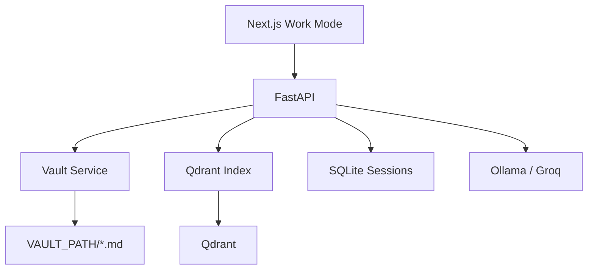

# VaultMind (AI-BRAIN) — Upgrade Plan v2

> **⚠️ DEPRECATED** — Council dropped JARVIS branding. User rejected.  
> **Use instead:** [UPGRADE_PLAN_JARVIS.md](./UPGRADE_PLAN_JARVIS.md)  
> **Loop transcript:** [JARVIS_COUNCIL_LOOP.md](./JARVIS_COUNCIL_LOOP.md)

**Council revision:** 2026-05-24 · Supersedes scope/timeline in [UPGRADE_PLAN.md](./UPGRADE_PLAN.md)  
**Council transcript:** [LLM_COUNCIL_REVIEW.md](./LLM_COUNCIL_REVIEW.md) · **Avg rating v1 plan:** 5.7/10 → **v2 target:** shippable MVP in 6 weeks

**Working product name:** **VaultMind** (repo may stay `AI-BRAIN` until v2.0.0 tag)

**One-line pitch:** Local chat that **reads and writes your Obsidian vault** — with citations, persistent threads, and zero fake data.

---

## What changed after council debate

| v1 plan | v2 council decision |
|---------|---------------------|
| 12 weeks to v3.1 | **6 weeks → v2.0 MVP**, **16 weeks → v3.0** (reduced) |
| Phase 1 = vault + RAG + SQLite + full UI | **Phase 1 split:** 1a write → 1b index → 1c UI+chat |
| Hybrid FTS in Phase 2 | **Deferred to v2.2** if eval fails |
| Tool-calling agent Phase 3 | **Backlog** — explicit UI actions only |
| JARVIS branding | **VaultMind** in docs; neutral assistant prompt Phase 0 |
| §13 full UI in Phase 1–2 | **UI MVP** in Phase 1; full §13 → Tier B |
| CI in P1 | **pytest in Phase 0** |
| recall@5 ≥ 0.7 at v2.1 | **Baseline eval at v2.0**, target 0.5 → tune → 0.65 at v2.2 |

---

## 1. North star (unchanged)

**Target:** Claude-quality *answers over your notes* + Obsidian-grade *persistence* — not cosplay, not 3D demo.

### v2.0 MVP — five capabilities only

1. **Save** assistant output to configured vault path (`.md` + frontmatter)  
2. **Ask** questions over vault contents with **file path citations**  
3. **Resume** chat after restart (SQLite sessions)  
4. **Work-mode UI** — chat + vault list; 3D graph hidden by default  
5. **Honest status** — Ollama / Qdrant / vault / sync; no silent fallbacks  

### v2.0 “done” definition

- [ ] Save from chat → file visible in Obsidian within 2s  
- [ ] Vault sync indexes `JARVIS/**/*.md` into Qdrant  
- [ ] 20-query eval run; recall@5 **baseline published** in README  
- [ ] pytest smoke green (health, vault jail, no demo repos)  
- [ ] 7-day personal dogfood log completed  
- [ ] `.gitignore` fixed; MIT LICENSE committed  

---

## 2. Tier system (scope control)

### Tier A — MVP spine (must ship)

Vault save · vault sync/RAG · citations · SQLite chat · Work UI shell · kill fallbacks · Phase 0 tests · token limits 4k · streaming (v2.1)

### Tier B — Post-v2 enhancements (scheduled)

| Item | Target |
|------|--------|
| Hybrid FTS | v2.2 *if* recall@5 < 0.5 |
| Command palette | v2.2 |
| Split preview pane | v2.2 |
| Thread rename/export | v2.1 |
| Brief → vault markdown | v2.1 |
| OAuth token encryption | v2.1 |
| GitHub ingest UI polish | v2.2 |
| `@` note mentions | v2.2 |
| Wikilinks / backlinks | v3.0 |

### Tier C — Demo / optional (never block release)

3D BrainGraph · Voice · Studio/image gen · YouTube ingest · Weekly review automation · Light theme · Tool-calling agent loop · Arcade scanline theme

**Rule:** Tier C features live behind flags or separate compose files; never in default install path.

---

## 3. Architecture (simplified v2)



**Dropped from v2 critical path:** Tasks runner · multi-collection ingest · watchdog · agent tool loop

**Indexing v2:** Single path — walk vault `*.md` → chunk → embed → Qdrant. Incremental by mtime. UI text filter for filename search (not BM25 yet).

---

## 4. Revised phased roadmap

### Phase 0 — Hygiene + test gate (Week 1)

**Goal:** Trustworthy repo; no fake data; CI exists.

| Task | Owner |
|------|-------|
| Fix `.gitignore` (stop ignoring source trees) | Backend |
| Add MIT LICENSE | Repo |
| Gate/remove `FALLBACK_REPOS`, brief/chat fallbacks when `DEMO_MODE=0` | Backend + Frontend |
| Fix README ports (8001 / 5050 / 6335) | Docs |
| CORS: `localhost:5050` only | Backend |
| Vault path jail + traversal tests | Backend |
| **pytest smoke:** `/health`, vault jail, demo off | Backend |
| Rebrand docs → **VaultMind**; neutral system prompt | Docs + Backend |
| **UI:** Status bar (Ollama/Qdrant/vault); demo banner; hide fake NEURONS count | Frontend |

**Tag:** `v1.0.1`  
**Gate:** pytest green before Phase 1 starts

---

### Phase 1a — Vault write path (Week 2)

**Goal:** Files land on disk.

| Task |
|------|
| Finish `services/vault.py` + `routers/vault.py` |
| `POST /vault/save`, `GET /vault/list`, `GET /vault/read/{path}` |
| Folder layout: `JARVIS/Chat`, `Briefs`, `Generated`, `Inbox` |
| YAML frontmatter: title, created, source, tags |
| `POST /vault/open` (Explorer / reveal) |
| Integration test: save → file exists under jail |

**Milestone:** curl save → `.md` in Obsidian vault

---

### Phase 1b — Vault read path (Week 3)

**Goal:** RAG over your notes.

| Task |
|------|
| `POST /vault/sync` — walk vault, chunk, embed, upsert Qdrant |
| Incremental sync by mtime + content hash (SHA256 ids) |
| Chat context: top-k vault chunks + **citation paths** in response |
| Relevance threshold — show “no vault hits” when empty |
| Remove fake repos from graph data pipeline |
| **Eval v0:** `scripts/eval_rag.py` with 10 seed queries (publish baseline) |

**Milestone:** Ask about your note → answer cites real path

---

### Phase 1c — UI + chat memory (Weeks 4–5)

**Goal:** Daily-usable desk app.

| Task |
|------|
| SQLite `sessions` + `messages` |
| **Minimal AppShell:** icon rail + sidebar + main (Work mode default) |
| Chat: Save to vault on every assistant message |
| Vault panel: **flat list** + markdown viewer (not full tree yet) |
| Settings modal: vault path, model, auto-save toggle |
| Raise `LLM_MAX_TOKENS=4096`; honest Ollama-offline banner |
| Tailwind + tokens.css + 5 UI primitives |
| 3D graph → optional route `/graph` or flag `GRAPH_MODE=1` |

**Tag:** `v2.0.0`  
**Gate:** 7-day dogfood + v2.0 checklist (below)

---

### Phase 2 — Quality pass (Weeks 6–9)

**Goal:** Claude-*class* feel, not full parity.

| Task |
|------|
| SSE streaming chat |
| Thread sidebar: new / list / delete |
| Export thread → vault markdown |
| Brief saves to `Briefs/YYYY-MM-DD.md` |
| RAG eval expanded to 20 queries; README metrics table |
| GitHub Actions: lint + pytest on PR |
| Calendar panel **beta** badge; OAuth encryption v2.1 |
| Code block → save as file in `Generated/` |

**Tag:** `v2.1.0`  
**Metric:** recall@5 ≥ **0.5** (not 0.7 yet)

---

### Phase 3 — Power user (Weeks 10–16)

**Goal:** Proactive workflows without agent cosplay.

| Task |
|------|
| Confirmed multi-step flows (user clicks Approve per step) |
| Watch-folder ingest (optional) |
| PDF/DOCX → `Inbox/` as markdown |
| Task checkboxes extracted to SQLite (no autonomous agent) |
| Command palette (`Ctrl+K`) |
| Split preview toggle |
| Graph tab polish (lazy load, link to vault note) |

**Tag:** `v3.0.0`  
**Metric:** 3 recorded demos (plan day, draft spec, research notes) — all artifacts in vault

---

### Phase 4 — Portfolio polish (Week 17+)

- Hybrid FTS **only if** eval still < 0.5  
- Prod Docker compose  
- Architecture docs  
- README screenshot set  
- Optional: extract `vaultmind-core` library for Lexprobe  

**Tag:** `v3.1.0`

---

## 5. v2.0.0 scope box

### IN (required for tag)

- [ ] `VAULT_PATH` config + settings UI  
- [ ] Save chat → `JARVIS/Chat/*.md`  
- [ ] Vault sync → Qdrant  
- [ ] Chat with vault citations  
- [ ] SQLite persistent sessions  
- [ ] Work-mode layout (3D not default)  
- [ ] Status bar + empty states + demo banner  
- [ ] `DEMO_MODE=0` → zero fake repos/data  
- [ ] pytest smoke CI  
- [ ] MIT LICENSE, fixed `.gitignore`  
- [ ] README: VaultMind positioning + setup + baseline eval  

### OUT (explicitly not v2.0)

- Hybrid BM25+vector  
- Tool-calling / agent loop  
- Voice commands  
- Studio / image gen in default compose  
- Command palette  
- Split preview  
- Wikilinks / backlinks  
- Light theme  
- Thread rename / `@` mentions  
- OAuth encryption (calendar beta OK with disclosure)  
- recall@5 ≥ 0.7  

---

## 6. UI MVP spec (council-trimmed §13)

### Ship in Phase 1c

| ID | Feature |
|----|---------|
| UI-1 | `AppShell`: icon rail (Chat, Vault, Brief, Settings, Graph) |
| UI-2 | Context sidebar: threads (basic) OR vault file list |
| UI-3 | Chat: message bubbles, Save button, copy, offline banner |
| UI-4 | Vault: flat sorted list + read-only markdown view |
| UI-5 | Settings modal |
| UI-6 | Top status: ● Ollama ● Qdrant ● vault path ● last sync |
| UI-7 | Toasts for save confirmation |
| UI-8 | Tailwind + Inter + lucide; 5 primitives |

### Defer Tier B

Command palette · split preview · `@` mentions · backlinks · file tree expand/collapse · skeleton polish · shortcuts overlay · resizable panels

### Defer Tier C

Light theme · Arcade/scanline mode · Storybook

---

## 7. LLM & RAG (revised)

### LLM Phase 1c

- Neutral assistant system prompt (no JARVIS persona)  
- `num_predict` / `max_tokens` = 4096  
- Groq optional for long drafts  
- Clear error when Ollama unreachable  

### LLM Phase 2+

- Streaming SSE  
- Model picker in settings  
- **No** model router until v3.0  

### RAG Phase 1b

- Qdrant-only vault collection  
- Chunk metadata: path, heading, mtime  
- Citations: `[1] path/to/note.md` in chat UI  

### RAG Phase 2+

- Eval harness 20 queries  
- Multi-collection (vault vs github) only after vault eval passes  

---

## 8. Security & DevOps (revised)

| When | What |
|------|------|
| Phase 0 | CORS fix, vault jail, pytest, `.gitignore`, LICENSE |
| v2.0 gate | All Phase 0 + save integration test |
| v2.1 | OAuth token encryption OR calendar disabled by default |
| v3.0 | Optional API key for LAN; prod Docker profile |

**Docker v2:** Remove studio from default `docker-compose.yml` → `compose.studio.yml`  
**Default env:** `IMAGE_ENABLED=false`, `DEMO_MODE=0`, `GRAPH_MODE=0`

---

## 9. Success metrics (revised)

| Metric | v1 | v2.0 | v2.1 | v3.0 |
|--------|-----|------|------|------|
| Notes saved to vault / session | 0 | 3+ | 5+ | 10+ |
| RAG recall@5 (20 queries) | — | baseline | ≥ 0.5 | ≥ 0.65 |
| Chat persistence | none | SQLite | + export | + threads UI |
| Silent fallback usage | high | **zero** | zero | zero |
| Time to first saved note | — | < 15 min | < 10 min | < 5 min |
| pytest tests | 0 | 8 | 15 | 25 |
| Dogfood days before tag | — | **7** | — | 14 cumulative |
| UI: 3D visible on first open | yes | **no** | no | no |

---

## 10. What NOT to build (council reinforced)

- JARVIS personality in prompts or marketing  
- Autonomous tool loop without per-step approval  
- Hybrid FTS before baseline eval  
- Full Obsidian editor replacement  
- Mobile PWA before desktop Work mode solid  
- More 3D particles before vault save works  
- Shipping v2.0 without pytest green  

---

## 11. Env template (v2)

```env
# Product
PRODUCT_NAME=VaultMind
DEMO_MODE=0
GRAPH_MODE=0
IMAGE_ENABLED=false

# Vault (required)
VAULT_PATH=C:\Users\You\Documents\My-Obsidian-Vault
AUTO_SAVE_VAULT=0
AUTO_SYNC_VAULT=1

# LLM
OLLAMA_URL=http://localhost:11434
OLLAMA_MODEL=llama3.2
GROQ_API_KEY=
LLM_MAX_TOKENS=4096

# RAG
QDRANT_URL=http://localhost:6335
EMBEDDING_MODEL=all-MiniLM-L6-v2

# Dev
DEV_MODE=0
```

---

## 12. Immediate next steps (unchanged priority)

1. Phase 0 — `.gitignore`, fallbacks, pytest, rebrand prompt  
2. Phase 1a — vault save API + test  
3. Phase 1b — vault sync + citations  
4. Phase 1c — Work UI + SQLite chat  
5. Tag `v2.0.0` only after scope box + dogfood  

---

## Related docs

| Doc | Purpose |
|-----|---------|
| [UPGRADE_PLAN.md](./UPGRADE_PLAN.md) | Original comprehensive plan (reference) |
| [LLM_COUNCIL_REVIEW.md](./LLM_COUNCIL_REVIEW.md) | Council ratings, debates, dissent |
| [IMPROVEMENTS_PLAN.md](./IMPROVEMENTS_PLAN.md) | Short audit checklist |

---

*v2 is the **execution plan**. v1 remains the **vision catalog / backlog**. When they conflict, v2 wins.*
